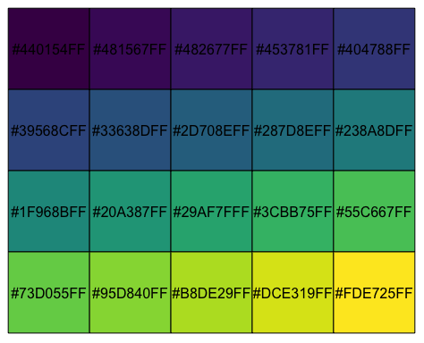

```{r setup, include=FALSE}
usethis::use_git_ignore(c("*.csv", "*.rds"))
options(htmltools.dir.version = FALSE)

library(knitr)
library(tidyverse)
library(xaringan)
library(fontawesome)
```

class: inverse, center, middle

# `r fa("far fa-images", fill = "#fff")`

**View the slides:** 

[bretsw.github.io/eme6356-module6](https://bretsw.github.io/eme6356-module6)

---

class: inverse, center, middle

# `r fa("fas fa-user-astronaut", fill = "#fff")` <br> Special Guest: <br> Dr. Joshua Rosenberg

---

# Dr. Joshua Rosenberg

```{r, out.width = "400px", echo = FALSE, fig.align = "center"}

```

<div class="caption">
<a href="https://joshuamrosenberg.com/">Dr. Rosenberg's website</a>
</div>

---

# Data stories

```{r, out.width = "420px", echo = FALSE, fig.align = "center"}

```

"For the first time, U.S. News launches rankings of public elementary and middle schools." (Tweet from [@USNewsEducation](https://twitter.com/USNewsEducation/status/1448011571658113028))

---

class: inverse, center, middle

# `r fa("fas fa-calculator", fill = "#fff")` <br> Statistical Prediction

---

# Bayesian Approach

```{r, out.width = "100%", echo = FALSE, fig.align = "center"}

```

<div class="caption">
<p>Rosenberg, J., Kubsch, M., Wagenmakers, E., & Dogucu, M. (2021, April 30). Why and How a Bayesian Approach Supports Science Educators and Learners to Reason Under Scientific Uncertainty. <a href="https://doi.org/10.31219/osf.io/aznyq">https://doi.org/10.31219/osf.io/aznyq</a></p>
</div>

---

# Bayesian Approach

```{r, out.width = "600px", echo = FALSE, fig.align = "center"}
include_graphics("img/6-bayes-fig2.png")
```

<div class="caption">
<p>Rosenberg, J., Kubsch, M., Wagenmakers, E., & Dogucu, M. (2021, April 30). Why and How a Bayesian Approach Supports Science Educators and Learners to Reason Under Scientific Uncertainty. <a href="https://doi.org/10.31219/osf.io/aznyq">https://doi.org/10.31219/osf.io/aznyq</a></p>
</div>

---

class: inverse, center, middle

# `r fa("fas fa-project-diagram", fill = "#fff")` <br> Social Network Analysis

---

# Twitter \#NGSSchat

```{r, out.width = "720px", echo = FALSE, fig.align = "center"}

```

<div class="caption">
<p>Rosenberg, J. M., Reid, J., Dyer, E., Koehler, M. J., Fischer, C., & McKenna, T. J. (2020). Idle chatter or compelling conversation? The potential of the social media-based #NGSSchat network as a support for science education reform efforts. Journal of Research in Science Teaching, 57(9), 1322-1355. <a href="https://doi.org/10.1002/tea.21660">https://doi.org/10.1002/tea.21660</a></p>
</div>

---

# Influence

```{r, out.width = "600px", echo = FALSE, fig.align = "center"}

```

<div class="caption">
<a href="https://sites.google.com/msu.edu/kenfrank/social-network-resources">SNA resources from Dr. Ken Frank's website</a>
</div>

---

# Selection

```{r, out.width = "560px", echo = FALSE, fig.align = "center"}

```

<div class="caption">
<a href="https://sites.google.com/msu.edu/kenfrank/social-network-resources">SNA resources from Dr. Ken Frank's website</a>
</div>

---

class: inverse, center, middle

# `r fa("far fa-comments", fill = "#fff")` <br> Module 5 Discussion

---

# Data Viz Resources

<div class="padlet-embed" style="border:1px solid rgba(0,0,0,0.1);border-radius:2px;box-sizing:border-box;overflow:hidden;position:relative;width:100%;background:#F4F4F4"><p style="padding:0;margin:0"><iframe src="https://fsu.padlet.org/embed/xxl6opndte57rmc5" frameborder="0" allow="camera;microphone;geolocation" style="width:100%;height:480px;display:block;padding:0;margin:0"></iframe></p><div style="padding:8px;text-align:right;margin:0;"><a href="https://padlet.com?ref=embed" style="padding:0;margin:0;border:none;display:block;line-height:1;height:16px" target="_blank"></a></div></div>

---

# Sharing Kudos

```{r, out.width = "420px", echo = FALSE, fig.align = "center"}
include_graphics("img/applause.jpg")
```

For sharing data visualization examples:

- `r fa("thumbs-up", fill = "#782F40")` Amy
- `r fa("thumbs-up", fill = "#782F40")` Jessica
- `r fa("thumbs-up", fill = "#782F40")` Lori
- `r fa("thumbs-up", fill = "#782F40")` Mark
- `r fa("thumbs-up", fill = "#782F40")` Sean
- `r fa("thumbs-up", fill = "#782F40")` Tiffany 

---

class: inverse, center, middle

#  Example \#1: <br> **Salaries**

(Thanks `r fa("thumbs-up", fill = "#fff")` Mark)

---

class: inverse, center, middle

# Soccer Salaries

```{r, out.width = "100%s", echo = FALSE, fig.align = "center"}

```

<div class="caption">
<a href="https://public.tableau.com/app/profile/fennsk/viz/MLSSalaries/MLSPUDashboard">Source: Steve Fenn @StatHunting</a>
</div>

---

class: inverse, center, middle

#  Example \#2: <br> **Maps**

(Thanks `r fa("thumbs-up", fill = "#fff")` Dré)

---

class: inverse, center, middle

# Map: Neil Kaye

<iframe id="Map Projection with True Country Size" title="Map Projection with True Country Size" src="https://www.natureindex.com/file/countries-map-projection-new" width="840" height="480"></iframe>

<div class="caption">
<a href="https://www.natureindex.com/news-blog/data-visualisation-animated-map-mercater-projection-true-size-countries">Source: A <i>Nature Index</i> article about Neil Kaye</a>
</div>

---

class: inverse, center, middle

# Map: Peirce Quincincial

<iframe id="Peirce Quincincial Map" title="Peirce Quincincial Map" src="https://dbd0051.blob.core.windows.net/assets/3418cc61-7d40-414e-86f2-4910b7cf0d08/7.Peirce_quincuncial_projection.jpg" width="480" height="480"></iframe>

<div class="caption">
<a href="https://futuremaps.com/blogs/news/top-10-world-map-projections">Source: The Future Mapping Company</a>
</div>

---

class: inverse, center, middle

#  Example \#3: <br> **Dissertation**

(Thanks `r fa("thumbs-up", fill = "#fff")` Dré, `r fa("thumbs-up", fill = "#fff")` Colleen, `r fa("thumbs-up", fill = "#fff")` Mark)

---

class: inverse, center, middle

# Dissertation Themes

(for my own use and general interest)

```{r, out.width = "100%s", echo = FALSE, fig.align = "center"}

```

<div class="caption">
<a href="https://bretsw.github.io/post/dissertation-themes/">Source: "Dissertation Themes" post on bretsw.com</a>
</div>

---

class: inverse, center, middle

# (Random aside: Choosing Colors)

Look for colorblind-friendly palettes that easily convert to grayscale.

```{r, out.width = "480", echo = FALSE, fig.align = "center"}

```

<div class="caption">
Source: <a href="http://bids.github.io/colormap/">Matplotlib colormaps.</a> See also Florencia Mangini's post <a href="https://www.thinkingondata.com/something-about-viridis-library/">"The Viridis palette for R."</a>
</div>

---

class: inverse, center, middle

# Dissertation Reliability

(for my dissertation committee)

```{r, out.width = "100%s", echo = FALSE, fig.align = "center"}
include_graphics("img/6-irr-comparison.png")
```

<div class="caption">
<a href="https://bretsw.github.io/post/irr-visual/">Source: "Visualizing Inter-rater Reliability" post on bretsw.com</a>
</div>

---

class: inverse, center, middle

# Dissertation Results

(for general interest)

<iframe id="Dissertation Text" title="Dissertation Text" src="https://bretsw.github.io/dissertation-text/results.html" width="800" height="480"></iframe>

<div class="caption">
<a href="https://bretsw.github.io/dissertation-text/index.html">Source: bretsw.com/dissertation-text</a>
</div>

---

class: inverse, center, middle

#  `r fa("far fa-lightbulb", fill = "#fff")` <br> Big Idea: <br> Follow the principles of <br> **Good Research Design**

---

# Good Research Design

```{r, out.width = "480px", echo = FALSE, fig.align = "center"}
include_graphics("img/planning.jpg")
```

--

- Start with research questions

--

- Understand your audience (e.g., public, dissertation committee, journal)

--

- Know your purpose (e.g., surprise, delight, scare, guide)

--

  - (Keep it ethical!!!)
  
---

# Good Research Design

```{r, out.width = "480px", echo = FALSE, fig.align = "center"}
include_graphics("img/planning.jpg")
```

- Mind your input: garbage data in, garbage data out (`r fa("thumbs-up", fill = "#782F40")` Rocco)

--

- Choose your output

--

  - Make choices with math (`r fa("thumbs-up", fill = "#782F40")` Shané)
  
--
  
  - Make choices with graphic design (`r fa("thumbs-up", fill = "#782F40")` Mark)

--

- Have fun! (be patient with yourself)

---

class: inverse, center, middle

# `r fa("fas fa-book-open", fill = "#fff")` <br> Module 6 readings: <br> Educational Data Mining <br> (EDM)

---

# Romero & Ventura, 2019

```{r, out.width = "100%", echo = FALSE, fig.align = "center"}

```

<div class="caption">
Romero, C., & Ventura, S. (2020). Educational data mining and learning analytics: An updated survey. Wiley Interdisciplinary Reviews: Data Mining and Knowledge Discovery, 10(3), 1-21. <a href="https://doi.org/10.1002/widm.1355">https://doi.org/10.1002/widm.1355</a>
</div>

---

# Romero & Ventura, 2019

```{r, out.width = "100%", echo = FALSE, fig.align = "center"}

```

<div class="caption">
Romero, C., & Ventura, S. (2020). Educational data mining and learning analytics: An updated survey. Wiley Interdisciplinary Reviews: Data Mining and Knowledge Discovery, 10(3), 1-21. <a href="https://doi.org/10.1002/widm.1355">https://doi.org/10.1002/widm.1355</a>
</div>

---

# Aldowah et al., 2019

```{r, out.width = "90%", echo = FALSE, fig.align = "center"}

```

<div class="caption">
Aldowah, H., Al-Samarraie, H., & Fauzy, W. M. (2019). Educational data mining and learning analytics for 21st century higher education: A review and synthesis. Telematics and Informatics, 37, 13-49. <a href="https://doi.org/10.1016/j.tele.2019.01.007">https://doi.org/10.1016/j.tele.2019.01.007</a>
</div>

---

# Aldowah et al., 2019

```{r, out.width = "100%", echo = FALSE, fig.align = "center"}

```

<div class="caption">
Aldowah, H., Al-Samarraie, H., & Fauzy, W. M. (2019). Educational data mining and learning analytics for 21st century higher education: A review and synthesis. Telematics and Informatics, 37, 13-49. <a href="https://doi.org/10.1016/j.tele.2019.01.007">https://doi.org/10.1016/j.tele.2019.01.007</a>
</div>

---

class: inverse, center, middle

# `r fa("fas fa-binoculars", fill = "#fff")` <br> Looking Ahead

---

# Semester schedule

```{r, out.width = "100%", echo = FALSE, fig.align = "center"}
include_graphics("img/across-time.jpg")
```

- Module 7: Challenges in Learning Analytics

- Module 8: Case Discussions

- Module 9: Future of Analytics

---

# Case Discussions (Module 8)

<div class="padlet-embed" style="border:1px solid rgba(0,0,0,0.1);border-radius:2px;box-sizing:border-box;overflow:hidden;position:relative;width:100%;background:#F4F4F4"><p style="padding:0;margin:0"><iframe src="https://fsu.padlet.org/embed/hszqtrsln5qjn59t" frameborder="0" allow="camera;microphone;geolocation" style="width:100%;height:480px;display:block;padding:0;margin:0"></iframe></p><div style="padding:8px;text-align:right;margin:0;"><a href="https://padlet.com?ref=embed" style="padding:0;margin:0;border:none;display:block;line-height:1;height:16px" target="_blank"></a></div></div>

---

class: inverse, center, middle

# Questions?

```{r, out.width = "480px", echo = FALSE, fig.align = "center"}
include_graphics("img/question.jpg")
```

**What questions can I answer for you now?**

**How can I support you this week?**

<hr>

`r fa("envelope", fill = "white")` [bret.staudtwillet@fsu.edu](mailto:bret.staudtwillet@fsu.edu) | `r fa("twitter", fill = "white")` [@bretsw](https://twitter.com/bretsw) | `r fa("globe", fill = "white")` [bretsw.com](http://bretsw.com)